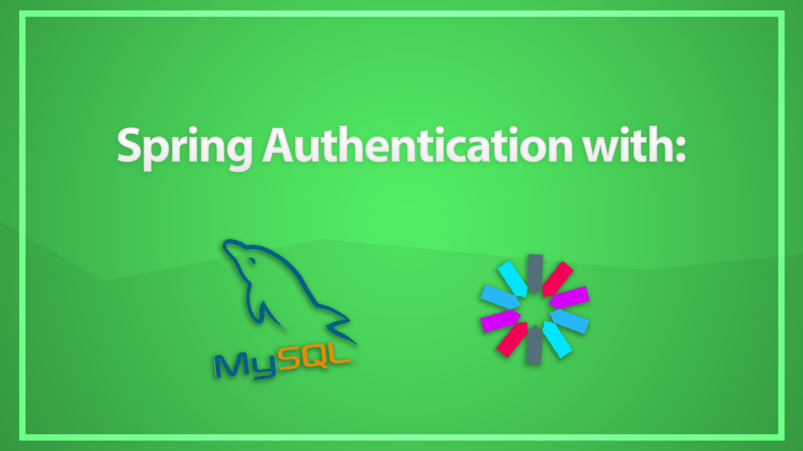

# Spring Authentication with JWT and MySQL
Simple Spring authentication Project with JWT and MySQL for learning purpose

## How to setup
Create a mysql database for example with [Docker](https://docker.com):
```bash
docker run -d -e MYSQL_ROOT_PASSWORD=secret -e MYSQL_DATABASE=taskdb --name mysqldb -p 3307:3306 mysql:8.0
```
This command generates a mysql container with the root password `secret`

## How to start
Open the project directory and run following command:
```bash
mvn spring-boot:run
```
This will start the Spring Application

## Enpoints overview:
### POST /auth/register
Request:
```json
{
    "fullName": "John Doe",
    "email": "johndoe@mail.com",
    "password": "password"
}
```
Response:
```json
{
    "id": "8a82b65b-ede5-42b9-b2c0-ec2a536294c7",
    "fullName": "John Doe",
    "email": "johndoe@mail.com",
    "password": "$2a$10$uPjEmhySIPDjTXblP2bdf.cw4Io.76XLdndDF0/9e4QPHdWWUfcc6",
    "createdAt": "2024-10-03T15:02:09.873+00:00",
    "updatedAt": "2024-10-03T15:02:09.873+00:00",
    "enabled": true,
    "authorities": [],
    "username": "johndoe@mail.com",
    "accountNonLocked": true,
    "accountNonExpired": true,
    "credentialsNonExpired": true
}
```

### POST /auth/login
Request:
```json
{
    "email": "johndoe@mail.com",
    "password": "password"
}
```
Response:
```json
{
    "token": "USERS_TOKEN",
    "expiresIn": 3600000
}
```

### GET /users
Request: Header with Bearer Authorization
Response:
```json
[
    {
        "id": "8a82b65b-ede5-42b9-b2c0-ec2a536294c7",
        "fullName": "John Doe",
        "email": "johndoe@mail.com",
        "password": "$2a$10$uPjEmhySIPDjTXblP2bdf.cw4Io.76XLdndDF0/9e4QPHdWWUfcc6",
        "createdAt": "2024-10-03T15:02:09.873+00:00",
        "updatedAt": "2024-10-03T15:02:09.873+00:00",
        "enabled": true,
        "authorities": [],
        "username": "johndoe@mail.com",
        "accountNonLocked": true,
        "accountNonExpired": true,
        "credentialsNonExpired": true
    }
]
```

### GET /users/me
Request: Header with Bearer Authorization
Response:
```json
{
    "id": "8a82b65b-ede5-42b9-b2c0-ec2a536294c7",
    "fullName": "John Doe",
    "email": "johndoe@mail.com",
    "password": "$2a$10$uPjEmhySIPDjTXblP2bdf.cw4Io.76XLdndDF0/9e4QPHdWWUfcc6",
    "createdAt": "2024-10-03T15:02:09.873+00:00",
    "updatedAt": "2024-10-03T15:02:09.873+00:00",
    "enabled": true,
    "authorities": [],
    "username": "johndoe@mail.com",
    "accountNonLocked": true,
    "accountNonExpired": true,
    "credentialsNonExpired": true
}
```
