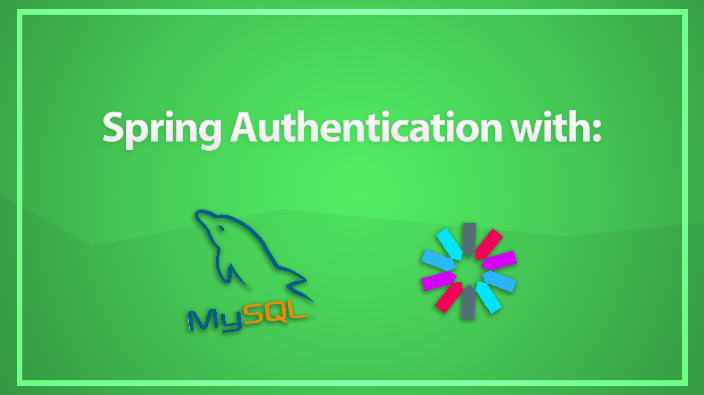

# Spring Authentication with JWT and MySQL
Simple Spring authentication Project with JWT and MySQL for learning purpose

## How to setup
Create a mysql database for example with [Docker](https://docker.com):
```bash
docker run -d -e MYSQL_ROOT_PASSWORD=secret -e MYSQL_DATABASE=taskdb --name mysqldb -p 3307:3306 mysql:8.0
```
This command generates a mysql container with the root password `secret`

## How to start
Open the project directory and run following command:
```bash
mvn spring-boot:run
```
This will start the Spring Application

## Enpoints overview:
### POST /auth/register
Request:
```json
{
    "fullName": "John Doe",
    "email": "johndoe@mail.com",
    "password": "password"
}
```
Response:
```json
{
  "user": {
    "id": "fda77ad1-4575-40c1-9ff4-be9f3a01da8e",
    "fullName": "John Doe",
    "email": "johndoe@mail.com",
    "createdAt": "2025-05-26T22:35:02.652+00:00",
    "updatedAt": "2025-05-26T22:35:02.652+00:00",
    "enabled": true,
    "authorities": [],
    "username": "johndoe@mail.com",
    "credentialsNonExpired": true,
    "accountNonExpired": true,
    "accountNonLocked": true
  },
  "token": "TOKEN",
  "expiresIn": 3600000
}
```

### POST /auth/login
Request:
```json
{
    "email": "johndoe@mail.com",
    "password": "password"
}
```
Response:
```json
{
  "user": {
    "id": "fda77ad1-4575-40c1-9ff4-be9f3a01da8e",
    "fullName": "John Doe",
    "email": "johndoe@mail.com",
    "createdAt": "2025-05-26T22:35:02.652+00:00",
    "updatedAt": "2025-05-26T22:35:02.652+00:00",
    "enabled": true,
    "authorities": [],
    "username": "johndoe@mail.com",
    "credentialsNonExpired": true,
    "accountNonExpired": true,
    "accountNonLocked": true
  },
  "token": "TOKEN",
  "expiresIn": 3600000
}
```

### GET /users
Request: Header with Bearer Authorization
Response:
```json
[
  {
    "id": "fda77ad1-4575-40c1-9ff4-be9f3a01da8e",
    "fullName": "John Doe",
    "email": "johndoe@mail.com",
    "createdAt": "2025-05-26T22:35:02.652+00:00",
    "updatedAt": "2025-05-26T22:35:02.652+00:00",
    "enabled": true,
    "authorities": [],
    "username": "johndoe@mail.com",
    "credentialsNonExpired": true,
    "accountNonExpired": true,
    "accountNonLocked": true
  }
]
```

### GET /users/me
Request: Header with Bearer Authorization
Response:
```json
{
  "id": "fda77ad1-4575-40c1-9ff4-be9f3a01da8e",
  "fullName": "John Doe",
  "email": "johndoe@mail.com",
  "createdAt": "2025-05-26T22:35:02.652+00:00",
  "updatedAt": "2025-05-26T22:35:02.652+00:00",
  "enabled": true,
  "authorities": [],
  "username": "johndoe@mail.com",
  "credentialsNonExpired": true,
  "accountNonExpired": true,
  "accountNonLocked": true
}
```
